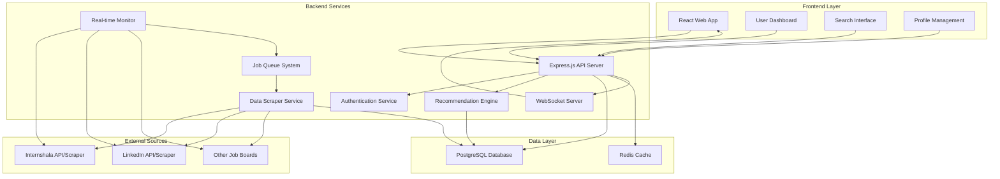
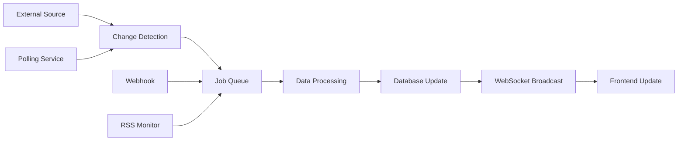

# Design Document

## Overview

The Internship Aggregator is a full-stack web application built with a React frontend and Node.js backend, using PostgreSQL for data persistence. The system employs a microservices-inspired architecture with distinct modules for web scraping, recommendation engine, user management, and API services. The platform aggregates internship data from multiple sources and provides personalized recommendations through machine learning algorithms.

## Architecture

### High-Level Architecture



### Technology Stack

**Frontend:**
- React 18 with TypeScript
- Material-UI or Tailwind CSS for styling
- React Router for navigation
- Axios for API communication
- React Query for state management and caching
- Socket.io-client for real-time updates
- React Toastify for instant notifications

**Backend:**
- Node.js with Express.js
- TypeScript for type safety
- JWT for authentication
- Bcrypt for password hashing
- Node-cron for scheduled tasks
- Socket.io for real-time updates
- Bull Queue for job processing and rate limiting
- Puppeteer for dynamic content scraping

**Database:**
- PostgreSQL for primary data storage
- Redis for caching and session storage

**Infrastructure:**
- Docker for containerization
- Nginx for reverse proxy and load balancing

## Real-Time Update System

### Continuous Data Monitoring Strategy

#### 1. Multi-Layered Update Approach
- **Webhook Integration**: Primary method for sites that support webhooks (LinkedIn API)
- **RSS/Atom Feeds**: Monitor RSS feeds where available for instant updates
- **Intelligent Polling**: Frequent polling (every 2-5 minutes) for high-priority sources
- **Change Detection**: Monitor specific pages for DOM changes using headless browsers
- **API Rate Limiting**: Respect rate limits while maximizing update frequency

#### 2. Real-Time Processing Pipeline


#### 3. Update Mechanisms by Source
- **Internshala**: Polling every 3 minutes + RSS feed monitoring
- **LinkedIn**: API webhooks (if available) + intelligent polling
- **Indeed**: RSS feeds + targeted page monitoring
- **Glassdoor**: Polling with change detection algorithms
- **Company Career Pages**: Sitemap monitoring + scheduled crawling

#### 4. Real-Time Notification System
- **WebSocket Connections**: Maintain persistent connections for instant updates
- **User Preference Filtering**: Only notify users about relevant opportunities
- **Notification Throttling**: Prevent spam by grouping similar updates
- **Offline Support**: Queue notifications for offline users

## Components and Interfaces

### Frontend Components

#### 1. Authentication Components
- **LoginForm**: User login interface
- **RegisterForm**: User registration with profile setup
- **ProtectedRoute**: Route wrapper for authenticated users

#### 2. Dashboard Components
- **UserDashboard**: Main landing page with recommendations
- **ApplicationTracker**: View and manage application status
- **RecommendationCard**: Display individual internship recommendations

#### 3. Search Components
- **SearchBar**: Keyword and location search
- **FilterPanel**: Advanced filtering options (duration, stipend, type)
- **InternshipList**: Paginated results display
- **InternshipCard**: Individual internship listing display

#### 4. Profile Components
- **ProfileEditor**: Edit user information and skills
- **SkillsSelector**: Multi-select component for user skills
- **PreferencesPanel**: Set location, salary, and other preferences

### Backend API Endpoints

#### Authentication Endpoints
```
POST /api/auth/register - User registration
POST /api/auth/login - User login
POST /api/auth/logout - User logout
GET /api/auth/profile - Get current user profile
PUT /api/auth/profile - Update user profile
```

#### Internship Endpoints
```
GET /api/internships - Search internships with filters
GET /api/internships/:id - Get specific internship details
GET /api/internships/recommendations - Get personalized recommendations
POST /api/internships/:id/apply - Track application to internship
```

#### Application Tracking Endpoints
```
GET /api/applications - Get user's applications
PUT /api/applications/:id - Update application status
DELETE /api/applications/:id - Remove application tracking
```

#### Real-Time Update Endpoints
```
GET /api/updates/stream - Server-sent events for real-time updates
POST /api/webhooks/internshala - Webhook endpoint for Internshala updates
POST /api/webhooks/linkedin - Webhook endpoint for LinkedIn updates
GET /api/updates/status - Get system update status and health
PUT /api/notifications/preferences - Update user notification preferences
```

#### WebSocket Events
```
connection - User connects to real-time updates
new_internship - New internship matching user preferences
internship_updated - Existing internship details changed
application_deadline - Approaching application deadlines
disconnect - User disconnects from real-time updates
```

### Backend Services

#### 1. Data Scraper Service
- **WebScraperManager**: Orchestrates scraping from multiple sources
- **InternshalaScaper**: Specific scraper for Internshala with real-time monitoring
- **LinkedInScraper**: LinkedIn job scraping (via API when possible) with webhook support
- **DataNormalizer**: Standardizes data format from different sources
- **DuplicateDetector**: Identifies and prevents duplicate listings
- **RealTimeMonitor**: Monitors external sites for new postings using webhooks/RSS feeds
- **ChangeDetector**: Detects changes in existing listings (status updates, deadline changes)
- **NotificationService**: Sends real-time updates to frontend via WebSockets

#### 2. Recommendation Engine
- **SkillMatcher**: Matches user skills with internship requirements
- **LocationPreferenceEngine**: Considers user location preferences
- **CompanyPreferenceEngine**: Learns from user application history
- **RecommendationScorer**: Calculates relevance scores for internships

#### 3. User Management Service
- **UserController**: Handles user CRUD operations
- **AuthenticationMiddleware**: JWT token validation
- **ProfileValidator**: Validates user profile data
- **SkillsManager**: Manages user skills and preferences

## Data Models

### User Schema
```sql
CREATE TABLE users (
    id SERIAL PRIMARY KEY,
    email VARCHAR(255) UNIQUE NOT NULL,
    password_hash VARCHAR(255) NOT NULL,
    first_name VARCHAR(100) NOT NULL,
    last_name VARCHAR(100) NOT NULL,
    phone VARCHAR(20),
    location VARCHAR(255),
    created_at TIMESTAMP DEFAULT CURRENT_TIMESTAMP,
    updated_at TIMESTAMP DEFAULT CURRENT_TIMESTAMP
);

CREATE TABLE user_skills (
    id SERIAL PRIMARY KEY,
    user_id INTEGER REFERENCES users(id) ON DELETE CASCADE,
    skill_name VARCHAR(100) NOT NULL,
    proficiency_level VARCHAR(20) DEFAULT 'beginner'
);

CREATE TABLE user_preferences (
    id SERIAL PRIMARY KEY,
    user_id INTEGER REFERENCES users(id) ON DELETE CASCADE,
    preferred_locations TEXT[],
    min_stipend INTEGER,
    max_duration_months INTEGER,
    work_type VARCHAR(20) DEFAULT 'any'
);
```

### Internship Schema
```sql
CREATE TABLE internships (
    id SERIAL PRIMARY KEY,
    title VARCHAR(255) NOT NULL,
    company_name VARCHAR(255) NOT NULL,
    description TEXT,
    location VARCHAR(255),
    stipend INTEGER,
    duration_months INTEGER,
    work_type VARCHAR(20) DEFAULT 'office',
    required_skills TEXT[],
    application_url VARCHAR(500),
    source_website VARCHAR(100) NOT NULL,
    external_id VARCHAR(255),
    posted_date DATE,
    application_deadline DATE,
    is_active BOOLEAN DEFAULT true,
    created_at TIMESTAMP DEFAULT CURRENT_TIMESTAMP,
    updated_at TIMESTAMP DEFAULT CURRENT_TIMESTAMP
);

CREATE INDEX idx_internships_skills ON internships USING GIN(required_skills);
CREATE INDEX idx_internships_location ON internships(location);
CREATE INDEX idx_internships_company ON internships(company_name);
```

### Application Tracking Schema
```sql
CREATE TABLE user_applications (
    id SERIAL PRIMARY KEY,
    user_id INTEGER REFERENCES users(id) ON DELETE CASCADE,
    internship_id INTEGER REFERENCES internships(id) ON DELETE CASCADE,
    application_status VARCHAR(50) DEFAULT 'applied',
    applied_date TIMESTAMP DEFAULT CURRENT_TIMESTAMP,
    last_updated TIMESTAMP DEFAULT CURRENT_TIMESTAMP,
    notes TEXT,
    UNIQUE(user_id, internship_id)
);

CREATE TABLE scraping_jobs (
    id SERIAL PRIMARY KEY,
    source_name VARCHAR(100) NOT NULL,
    job_type VARCHAR(50) NOT NULL, -- 'full_scrape', 'incremental', 'webhook'
    status VARCHAR(20) DEFAULT 'pending', -- 'pending', 'running', 'completed', 'failed'
    started_at TIMESTAMP,
    completed_at TIMESTAMP,
    records_processed INTEGER DEFAULT 0,
    records_added INTEGER DEFAULT 0,
    records_updated INTEGER DEFAULT 0,
    error_message TEXT,
    next_run_at TIMESTAMP
);

CREATE TABLE update_notifications (
    id SERIAL PRIMARY KEY,
    user_id INTEGER REFERENCES users(id) ON DELETE CASCADE,
    internship_id INTEGER REFERENCES internships(id) ON DELETE CASCADE,
    notification_type VARCHAR(50) NOT NULL, -- 'new_match', 'deadline_reminder', 'status_change'
    is_read BOOLEAN DEFAULT false,
    sent_at TIMESTAMP DEFAULT CURRENT_TIMESTAMP,
    delivery_method VARCHAR(20) DEFAULT 'websocket' -- 'websocket', 'email', 'push'
);

CREATE INDEX idx_scraping_jobs_source ON scraping_jobs(source_name, next_run_at);
CREATE INDEX idx_notifications_user_unread ON update_notifications(user_id, is_read);
```

## Error Handling

### Frontend Error Handling
- **Global Error Boundary**: Catches and displays React component errors
- **API Error Interceptor**: Handles HTTP errors and displays user-friendly messages
- **Form Validation**: Client-side validation with real-time feedback
- **Network Error Handling**: Offline detection and retry mechanisms

### Backend Error Handling
- **Global Error Middleware**: Centralized error processing and logging
- **Validation Errors**: Input validation with detailed error messages
- **Database Error Handling**: Connection failures and query error recovery
- **Rate Limiting**: Prevent abuse and handle scraping rate limits
- **Logging System**: Structured logging with different severity levels

### Error Response Format
```json
{
  "success": false,
  "error": {
    "code": "VALIDATION_ERROR",
    "message": "Invalid input data",
    "details": {
      "field": "email",
      "reason": "Email format is invalid"
    }
  }
}
```

## Testing Strategy

### Frontend Testing
- **Unit Tests**: Jest and React Testing Library for component testing
- **Integration Tests**: Test user flows and API integration
- **E2E Tests**: Cypress for critical user journeys
- **Visual Regression Tests**: Ensure UI consistency across updates

### Backend Testing
- **Unit Tests**: Jest for individual service and utility functions
- **Integration Tests**: Test API endpoints with test database
- **Database Tests**: Test data models and complex queries
- **Scraper Tests**: Mock external websites for scraper validation

### Performance Testing
- **Load Testing**: Simulate concurrent users with Artillery or k6
- **Database Performance**: Query optimization and indexing validation
- **Caching Strategy**: Redis cache hit rates and performance impact
- **Scraping Performance**: Monitor scraping speed and success rates

### Security Testing
- **Authentication Tests**: JWT token validation and expiration
- **Authorization Tests**: Ensure proper access controls
- **Input Validation**: SQL injection and XSS prevention
- **Rate Limiting Tests**: Verify API rate limiting effectiveness

## Deployment and Infrastructure

### Development Environment
- Docker Compose for local development
- Hot reloading for both frontend and backend
- Separate test database for development

### Production Environment
- Containerized deployment with Docker
- Nginx reverse proxy for load balancing
- PostgreSQL with connection pooling
- Redis cluster for high availability
- Automated backups and monitoring

### CI/CD Pipeline
- GitHub Actions for automated testing
- Automated deployment to staging environment
- Production deployment with manual approval
- Database migration automation
- Environment-specific configuration management